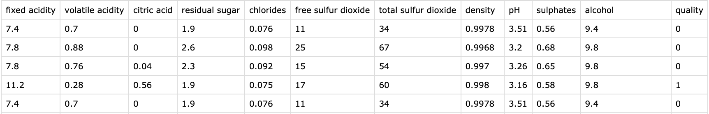

# cs131-SKLL-practice
- scikit-learn is a free software machine learning library for the Python programming language. It features various classification, regression and clustering algorithms including support-vector machines, random forests, gradient boosting, k-means and DBSCAN, and is designed to interoperate with the Python numerical and scientific libraries NumPy and SciPy. Scikit-learn is a NumFOCUS fiscally sponsored project. [Wikipedia]
- SKLL (pronounced “skull”) provides a number of utilities to make it simpler to run common scikit-learn experiments with pre-generated features. [SKLL website]

## Preprocessing
First, write a code to clean up the dataset, using awk and shell scripting. (See mysplit.sh)
- Delimiter: Change semicolons to colons
- Label modification: Simplify the dataset so we can solve it as a binary classification problem
  - If the quality is >= 6, it is good wine = 1.
  - If <6, it is bad wine = 0.
- Create training and test datasets
  - 80% training
  - 20% test
- A clean dataset should look like:

## SKLL Configuration
- [SKLL tutorial](https://scikit-learn-laboratory.readthedocs.io/en/latest/tutorial.html)
- [SKLL configuration file](https://scikit-learn-laboratory.readthedocs.io/en/latest/run_experiment.html)
- [List of learners available](https://scikit-learn-laboratory.readthedocs.io/en/latest/run_experiment.html#learners)